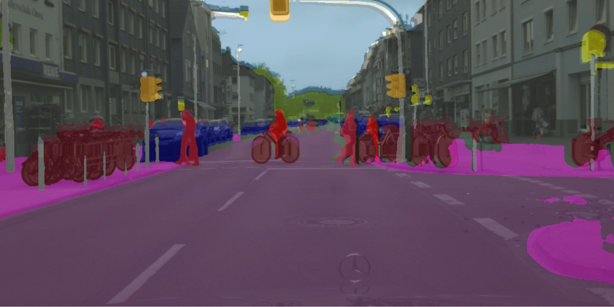
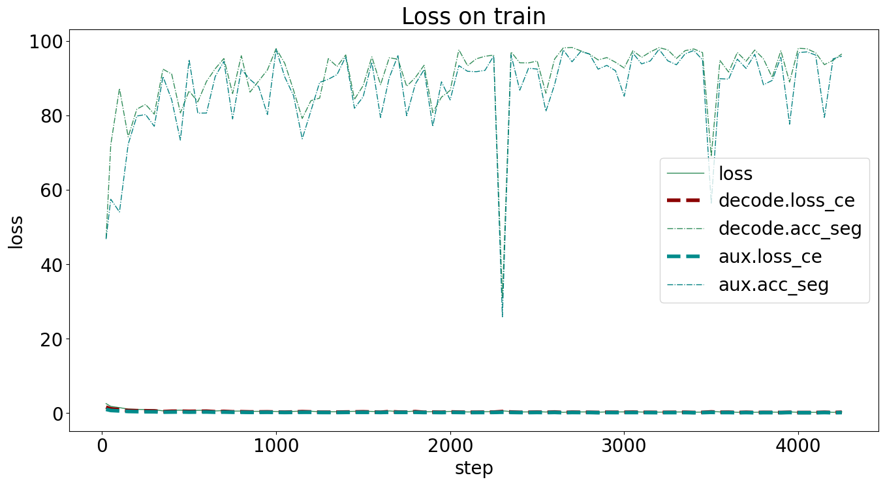
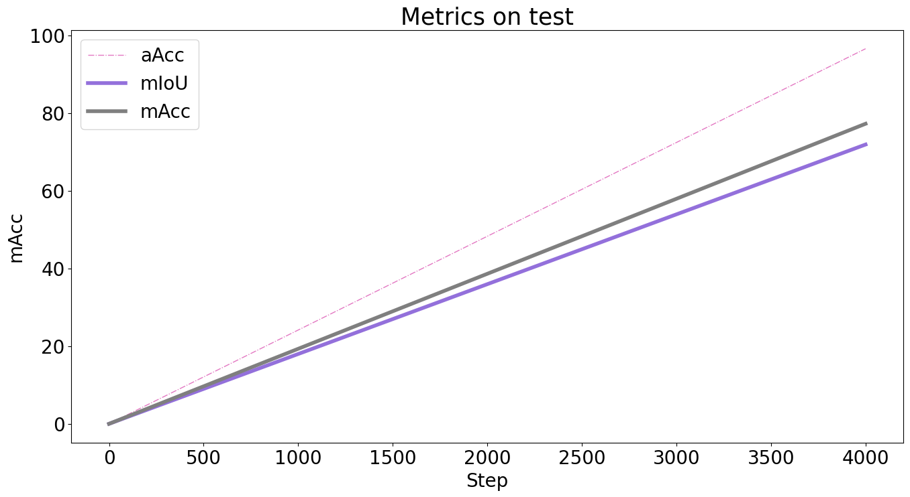

# MMSegmentation——Watermelon Segmentation

# 环境配置

https://mmsegmentation.readthedocs.io/en/latest/get_started.html

```shell
conda create -n mmseg python=3.8 -y

conda activate mmseg

git clone git@github.com:open-mmlab/mmsegmentation.git

cd mmsegmentation

# conda config --add channels conda-forge
conda config --add channels https://mirrors.tuna.tsinghua.edu.cn/anaconda/pkgs/main
conda config --add channels https://mirrors.tuna.tsinghua.edu.cn/anaconda/pkgs/free
conda config --add channels https://mirrors.tuna.tsinghua.edu.cn/anaconda/pkgs/r
conda config --add channels https://mirrors.tuna.tsinghua.edu.cn/anaconda/pkgs/pro
conda config --add channels https://mirrors.tuna.tsinghua.edu.cn/anaconda/pkgs/msys2

# conda install mamba -y

conda install pytorch torchvision -c pytorch -y
# conda install pytorch==1.12.1 torchvision==0.13.1 torchaudio==0.12.1 cudatoolkit=11.3 -c pytorch -y

pip install -U openmim

pip install -U "mmengine>=0.7.1, <1.0.0" -i https://pypi.tuna.tsinghua.edu.cn/simple

mim install -e . -y
```

## 安装验证

```shell
mim download mmsegmentation --config pspnet_r50-d8_4xb2-40k_cityscapes-512x1024 --dest .
```

```shell
python demo/image_demo.py demo/demo.png configs/pspnet/pspnet_r50-d8_4xb2-40k_cityscapes-512x1024.py pspnet_r50-d8_512x1024_40k_cityscapes_20200605_003338-2966598c.pth --device cuda:0 --out-file result.jpg
```

在当前目录生成result图片：



### 安装成功！

# 数据集准备

https://mmsegmentation.readthedocs.io/en/latest/user_guides/2_dataset_prepare.html

## LabelMe介绍

> LabelMe是一个用于图像标注和注释的开源工具，旨在帮助研究人员和开发人员创建用于机器学习和计算机视觉任务的标注数据集。
>
> ## 标注格式
>
> LabelMe支持两种主要的标注格式：XML和JSON。
>
> ### XML标注格式
>
> XML是LabelMe最常用的标注格式之一。下面是一个XML标注文件的示例结构：
>
> ```xml
> <annotation>
>     <folder>Folder_Name</folder>
>     <filename>Image_Name.jpg</filename>
>     <path>/path/to/image/Image_Name.jpg</path>
>     <source>
>         <database>Unknown</database>
>     </source>
>     <size>
>         <width>640</width>
>         <height>480</height>
>         <depth>3</depth>
>     </size>
>     <segmented>0</segmented>
>     <object>
>         <name>Object_Name</name>
>         <pose>Unspecified</pose>
>         <truncated>0</truncated>
>         <difficult>0</difficult>
>         <bndbox>
>             <xmin>100</xmin>
>             <ymin>150</ymin>
>             <xmax>300</xmax>
>             <ymax>400</ymax>
>         </bndbox>
>     </object>
>     <!-- 可能会有多个<object>标签，对应于图像中的多个对象 -->
> </annotation>
> ```
>
> ### JSON标注格式
>
> 除了XML，LabelMe还可以生成JSON文件作为标注数据的输出格式。以下是一个JSON标注文件的示例结构：
>
> ```json
> {
>   "version": "4.5.6",
>   "flags": {},
>   "shapes": [
>     {
>       "label": "Object_Name",
>       "points": [
>         [100, 150],
>         [300, 150],
>         [300, 400],
>         [100, 400]
>       ],
>       "group_id": null,
>       "shape_type": "polygon",
>       "flags": {}
>     }
>   ],
>   "imagePath": "Image_Name.jpg",
>   "imageData": "...base64-encoded-image-data...",
>   "imageHeight": 480,
>   "imageWidth": 640
> }
> ```
>
> ## 标注流程
>
> 使用LabelMe进行图像标注通常遵循以下流程：
>
> 1. 打开LabelMe工具。
> 2. 加载要标注的图像文件。
> 3. 在图像上手动绘制边界框、多边形、线条或点，以标注感兴趣的对象或区域。
> 4. 为每个对象添加标签、注释和描述等附加信息。
> 5. 保存标注数据到XML或JSON文件中。
>
> ## 应用领域
>
> LabelMe在物体检测、语义分割、图像分析等领域的研究和实际应用中被广泛使用。它为用户提供了一个简单易用的界面，可以高效地创建和管理标注数据集，为机器学习算法的训练和评估提供了重要的支持。

原始数据以labelme格式储存，mmseg中用到的数据集需要原始图片和对应的mask图片，以cityspaces数据集为例

```python
# Copyright (c) OpenMMLab. All rights reserved.
from mmseg.registry import DATASETS
from .basesegdataset import BaseSegDataset


@DATASETS.register_module()
class CityscapesDataset(BaseSegDataset):
    """Cityscapes dataset.

    The ``img_suffix`` is fixed to '_leftImg8bit.png' and ``seg_map_suffix`` is
    fixed to '_gtFine_labelTrainIds.png' for Cityscapes dataset.
    """
    METAINFO = dict(
        classes=('road', 'sidewalk', 'building', 'wall', 'fence', 'pole',
                 'traffic light', 'traffic sign', 'vegetation', 'terrain',
                 'sky', 'person', 'rider', 'car', 'truck', 'bus', 'train',
                 'motorcycle', 'bicycle'),
        palette=[[128, 64, 128], [244, 35, 232], [70, 70, 70], [102, 102, 156],
                 [190, 153, 153], [153, 153, 153], [250, 170,
                                                    30], [220, 220, 0],
                 [107, 142, 35], [152, 251, 152], [70, 130, 180],
                 [220, 20, 60], [255, 0, 0], [0, 0, 142], [0, 0, 70],
                 [0, 60, 100], [0, 80, 100], [0, 0, 230], [119, 11, 32]])

    def __init__(self,
                 img_suffix='_leftImg8bit.png',
                 seg_map_suffix='_gtFine_labelTrainIds.png',
                 **kwargs) -> None:
        super().__init__(
            img_suffix=img_suffix, seg_map_suffix=seg_map_suffix, **kwargs)
```

本项目中用到的西瓜数据集已做好相关处理，转成了原始图片+mask图片的形式

```shell
.
├── ann_dir
│   ├── train
│   └── val
└── img_dir
    ├── train
    └── val
```

## 自定义数据集类型

在mmseg框架中使用自定义数据集，需要自定义数据集类，在`mmsegmentation/mmseg/datasets`中

```shell
# 加入watermelon.py在mmsegmentation/mmseg/datasets目录下
.
├── ade.py
├── basesegdataset.py
├── chase_db1.py
├── cityscapes.py
├── coco_stuff.py
......
├── __init__.py
├── isaid.py
├── pascal_context.py
├── potsdam.py
├── __pycache__
├── synapse.py
├── transforms
└── voc.py
```

### `watermelon.py`

```python
# 参考cityscapes.py格式

# Copyright (c) OpenMMLab. All rights reserved.
from mmseg.registry import DATASETS
from .basesegdataset import BaseSegDataset


@DATASETS.register_module()
class WatermelonDataset(BaseSegDataset):
    """Watermelon dataset.

    The ``img_suffix`` is fixed to '.jpg' and ``seg_map_suffix`` is
    fixed to '.png' for Watermelon dataset.
    """
    METAINFO = dict(
        # The index of the classes element needs to be equal to the grayscale value of the mask
        classes=('Unlabeled', 'red', 'green', 'white', 'seed-black', 'seed-white'),
        palette=[[128, 64, 128], [244, 35, 232], [70, 70, 70], [102, 102, 156],
                 [190, 153, 153], [153, 153, 153]])

    def __init__(self,
                 img_suffix='.jpg',
                 seg_map_suffix='.png',
                 **kwargs) -> None:
        super().__init__(
            img_suffix=img_suffix, seg_map_suffix=seg_map_suffix, **kwargs)

```

## 导入\__init__.py

在`__init__.py`中加入修改以下代码

```python
......
from .watermelon import WatermelonDataset
......
__all__.append('WatermelonDataset')
```

# 配置Config（以pspnet_r50-d8_4xb2-40k_cityscapes-512x1024为例）

## 获得config

在安装验证的过程中，我们已经下载了`pspnet_r50-d8_4xb2-40k_cityscapes-512x1024.py`

> ```shell
> mim download mmsegmentation --config pspnet_r50-d8_4xb2-40k_cityscapes-512x1024 --dest .
> ```

## 自定义config

自定义config参考：https://mmsegmentation.readthedocs.io/en/latest/user_guides/1_config.html

复制`pspnet_r50-d8_4xb2-40k_cityscapes-512x1024.py`，新建`my_pspnet_r50-d8_4xb2-40k_cityscapes-512x1024.py`

### `my_pspnet_r50-d8_4xb2-40k_cityscapes-512x1024.py`

```python
dataset_type = 'WatermelonDataset'
data_root = '/root/autodl-tmp/data/watermelon_mask'
train_img_path = 'img_dir/train'
train_map_path = 'ann_dir/train'
val_img_path = 'img_dir/train'
val_map_path = 'ann_dir/train'
test_img_path = 'img_dir/val'
test_map_path = 'ann_dir/val'
optimizer = dict(type='SGD', lr=0.001, momentum=0.9, weight_decay=0.0005)

......
# 省略原pspnet_r50-d8_4xb2-40k_cityscapes-512x1024.py的内容，部分参数改为变量，读取以上变量完成传参
```

### 修改内容

将原`pspnet_r50-d8_4xb2-40k_cityscapes-512x1024.py`中的以下元素改为变量，在`my_pspnet_r50-d8_4xb2-40k_cityscapes-512x1024.py`中自定义以下变量，传参给`pspnet_r50-d8_4xb2-40k_cityscapes-512x1024.py`

- dataset_type（数据集类）
- path（train、val、test）
- optimizer（lr改为0.001）
- default_hooks（增加save_best='auto'）

## 模型训练

```shell
python3 \
/root/autodl-tmp/work/mmsegmentation-main/tools/train.py \
/root/autodl-tmp/work/experiment/my_pspnet_r50-d8_4xb2-40k_cityscapes-512x1024.py \
> output_seg.log 2>&1
```

## 训练结果（iter4000）

> +------------+-------+-------+
>
> |  Class   |  IoU  |  Acc  |
>
> +------------+-------+-------+
>
> |   red   | 95.72 | 97.86 |
>
> |  green   |  95.7 |  98.7 |
>
> |  white   | 81.12 | 84.32 |
>
> | seed-black | 83.98 |  90.6 |
>
> | seed-white | 65.44 | 82.38 |
>
> | Unlabeled  |  9.45 |  9.63 |
>
> +------------+-------+-------+
>
> 06/15 14:57:02 - mmengine - INFO - Iter(val) [46/46]   aAcc: 96.5700  mIoU: 71.9000  mAcc: 77.2500  data_time: 0.0132  time: 0.7237





## 模型测试

```shell
python3 \
/root/autodl-tmp/work/mmsegmentation-main/tools/test.py \
/root/autodl-tmp/work/experiment/my_pspnet_r50-d8_4xb2-40k_cityscapes-512x1024.py \
/root/autodl-tmp/work/experiment/work_dirs/my_pspnet_r50-d8_4xb2-40k_cityscapes-512x1024/best_aAcc_iter_4000.pth \
> output_seg_t.log 2>&1
```

## 测试结果

>  +------------+-------+-------+
>
>  |  Class   |  IoU  |  Acc  |
>
>  +------------+-------+-------+
>
>  |   red   | 91.77 | 92.45 |
>
>  |  green   |  91.0 | 99.13 |
>
>  |  white   | 68.09 | 96.57 |
>
>  | seed-black | 79.46 | 85.34 |
>
>  | seed-white | 64.57 | 72.61 |
>
>  | Unlabeled  |  1.66 |  1.66 |
>
>  +------------+-------+-------+
>
>  06/15 15:02:11 - mmengine - INFO - Iter(test) [11/11]   aAcc: 93.7400  mIoU: 66.0900  mAcc: 74.6300  data_time: 0.0375  time: 1.0162

均明显优于baseline

- aAcc: 60.6200
- mIoU: 21.1400
- mAcc: 28.4600

## 推理验证

```shell
python \
/root/autodl-tmp/work/mmsegmentation-main/demo/image_demo.py \
/root/autodl-tmp/data/watermelon.jpeg \
/root/autodl-tmp/work/experiment/my_pspnet_r50-d8_4xb2-40k_cityscapes-512x1024.py \
/root/autodl-tmp/work/experiment/work_dirs/my_pspnet_r50-d8_4xb2-40k_cityscapes-512x1024/best_aAcc_iter_4000.pth \
--device cuda:0 \
--out-file watermelon_seg.jpg
```


### 效果不错

# 踩坑

## 1 FileNotFoundError

训练时遇到以下问题

```python
Original Traceback (most recent call last):
  File "/root/miniconda3/envs/mmseg/lib/python3.8/site-packages/torch/utils/data/_utils/worker.py", line 302, in _worker_loop
    data = fetcher.fetch(index)
  File "/root/miniconda3/envs/mmseg/lib/python3.8/site-packages/torch/utils/data/_utils/fetch.py", line 49, in fetch
    data = [self.dataset[idx] for idx in possibly_batched_index]
  File "/root/miniconda3/envs/mmseg/lib/python3.8/site-packages/torch/utils/data/_utils/fetch.py", line 49, in <listcomp>
    data = [self.dataset[idx] for idx in possibly_batched_index]
  File "/root/miniconda3/envs/mmseg/lib/python3.8/site-packages/mmengine/dataset/base_dataset.py", line 408, in __getitem__
    data = self.prepare_data(idx)
  File "/root/miniconda3/envs/mmseg/lib/python3.8/site-packages/mmengine/dataset/base_dataset.py", line 790, in prepare_data
    return self.pipeline(data_info)
  File "/root/miniconda3/envs/mmseg/lib/python3.8/site-packages/mmengine/dataset/base_dataset.py", line 58, in __call__
    data = t(data)
  File "/root/miniconda3/envs/mmseg/lib/python3.8/site-packages/mmcv/transforms/base.py", line 12, in __call__
    return self.transform(results)
  File "/root/miniconda3/envs/mmseg/lib/python3.8/site-packages/mmcv/transforms/loading.py", line 342, in transform
    self._load_seg_map(results)
  File "/root/autodl-tmp/work/mmsegmentation-main/mmseg/datasets/transforms/loading.py", line 93, in _load_seg_map
    img_bytes = fileio.get(
  File "/root/miniconda3/envs/mmseg/lib/python3.8/site-packages/mmengine/fileio/io.py", line 181, in get
    return backend.get(filepath)
  File "/root/miniconda3/envs/mmseg/lib/python3.8/site-packages/mmengine/fileio/backends/local_backend.py", line 33, in get
    with open(filepath, 'rb') as f:
FileNotFoundError: [Errno 2] No such file or directory: '/root/autodl-tmp/data/watermelon_mask/ann_dir/train/21746.1.png'
```

通过pdb调试，发现前几次迭代正常

```python
> /root/miniconda3/envs/mmseg/lib/python3.8/site-packages/mmengine/runner/loops.py(165)__next__()
-> data = next(self._iterator)
(Pdb) c
> /root/miniconda3/envs/mmseg/lib/python3.8/site-packages/mmengine/runner/loops.py(165)__next__()
-> data = next(self._iterator)
(Pdb) c
> /root/miniconda3/envs/mmseg/lib/python3.8/site-packages/mmengine/runner/loops.py(165)__next__()
-> data = next(self._iterator)
```

### 原因

既然前几次迭代正常，说明可能是单个文件的问题，检查ann和img，发现img中有`21746.1.png`，但ann中对应文件名为`21746.png`，将`21746.1.png`改为`21746.png`，问题得到解决